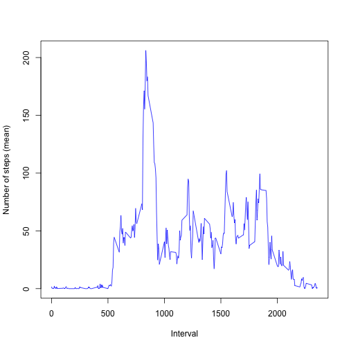
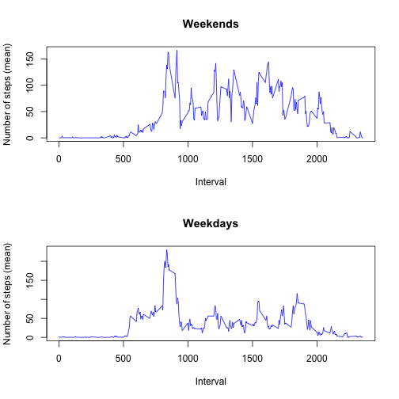

# Reproducible Research: Peer Assessment 1


## Loading and preprocessing the data


```r
activity <- read.csv("~/Development/RepData_PeerAssessment1/activity.csv")
activity$date <- as.Date(activity$date)
```


## What is mean total number of steps taken per day?


```r
stepsPerDay <- tapply(activity$steps, activity$date, sum, na.rm = T)
hist(stepsPerDay)
```

 

```r

mean(stepsPerDay)
```

```
## [1] 9354
```

```r

median(stepsPerDay)
```

```
## [1] 10395
```


## What is the average daily activity pattern?


```r
stepsPerInterval <- tapply(activity$steps, activity$interval, mean, na.rm = T)
plot(names(stepsPerInterval), stepsPerInterval, type = "l", col = "blue", xlab = "Interval", 
    ylab = "Number of steps (mean)")
```

 


## Imputing missing values


```r
# missing rows
missingRows <- is.na(activity$steps)
sum(missingRows)
```

```
## [1] 2304
```

```r

activity2 <- activity
intervalForMissingRows <- activity2$interval[which(missingRows)]
activity2$steps[which(missingRows)] <- as.vector(stepsPerInterval[as.character(intervalForMissingRows)])

stepsPerDay2 <- tapply(activity2$steps, activity2$date, sum, na.rm = T)
hist(stepsPerDay2)
```

 

```r

mean(stepsPerDay2)
```

```
## [1] 10766
```

```r

median(stepsPerDay2)
```

```
## [1] 10766
```


## Are there differences in activity patterns between weekdays and weekends?


```r
weekdays <- weekdays(activity2$date)
activity2$is.weekend <- weekdays == "Saturday" | weekdays == "Sunday"

# subset data
weekendActivities <- activity2[activity2$is.weekend, ]
weekdayActivities <- activity2[!activity2$is.weekend, ]

# mean across intervals
stepsPerIntervalWeekEnd <- tapply(weekendActivities$steps, weekendActivities$interval, 
    mean, na.rm = T)
stepsPerIntervalWeekDay <- tapply(weekdayActivities$steps, weekdayActivities$interval, 
    mean, na.rm = T)

par(mfrow = c(2, 1))
plot(names(stepsPerIntervalWeekEnd), stepsPerIntervalWeekEnd, type = "l", col = "blue", 
    xlab = "Interval", ylab = "Number of steps (mean)", main = "Weekends")
plot(names(stepsPerIntervalWeekDay), stepsPerIntervalWeekDay, type = "l", col = "blue", 
    xlab = "Interval", ylab = "Number of steps (mean)", main = "Weekdays")
```

 

